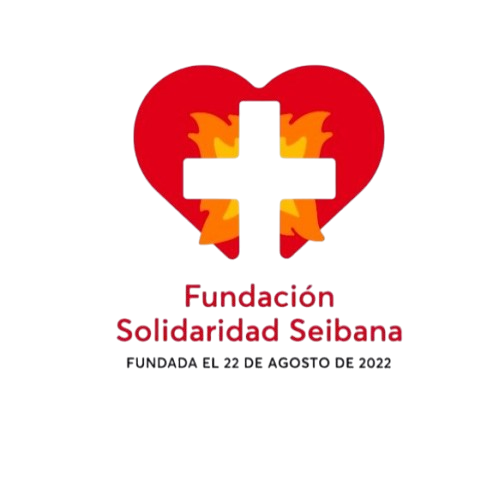

# 🏠 Fundación Solidaridad Seibana V1.0.1

<p align="center">
  
  <br>
  <b>Construyendo hogares, transformando vidas.</b>
</p>

---

### 🌟 Sobre el Proyecto
Sitio web oficial de la **Fundación Solidaridad Seibana**, una organización sin fines de lucro dedicada a la construcción de viviendas dignas y ayuda humanitaria en comunidades vulnerables de la República Dominicana.

---

## 🛠️ Tecnologías Utilizadas


* **Fuentes:** Google Fonts (Montserrat & Open Sans)
* **Iconos:** Font Awesome
* **Diseño:** Responsive (Mobile First)

---

## 📂 Estructura del Proyecto

```text
## Estructura del Proyecto

fundacion-solidaridad-seibana/
├── public/
│   ├── index.html                  # Página principal
│   ├── favicon.ico                 # Icono del sitio
│   └── assets/
│       ├── images/                 # Imágenes, logos, banners
│       └── icons/                  # Iconos SVG u otros
│
├── src/
│   ├── css/
│   │   ├── main.css                # CSS principal
│   │   ├── base/
│   │   │   ├── variables.css       # Colores, tipografía, espaciados
│   │   │   ├── reset.css           # Reset CSS
│   │   │   ├── typography.css      # Tipografía y estilos base
│   │   │   └── utilities.css       # Clases utilitarias
│   │   ├── components/
│   │   │   ├── navbar.css
│   │   │   ├── hero.css
│   │   │   ├── team.css
│   │   │   ├── gallery.css
│   │   │   ├── donation.css
│   │   │   ├── cards.css
│   │   │   └── footer.css
│   │   └── pages/
│   │       ├── home.css
│   │       ├── contact.css
│   │       ├── advice.css
│   │       ├── mission.css
│   │       └── projects.css
│   │
│   ├── js/
│   │   ├── main.js                 # Inicialización global
│   │   ├── components/
│   │   │   ├── navbar.js
│   │   │   ├── hero.js
│   │   │   ├── gallery.js
│   │   │   ├── modal.js
│   │   │   ├── donation/
│   │   │   │   ├── donation-controller.js
│   │   │   │   ├── donation-ui.js
│   │   │   │   ├── donation-state.js
│   │   │   │   ├── paypal.js
│   │   │   │   ├── stripe.js
│   │   │   │   ├── bank-transfer.js
│   │   │   │   └── qr-payment.js
│   │   │   ├── donation.js
│   │   │   ├── hero-slider.js
│   │   │   ├── navigations.js
│   │   │   └── preloader.js
│   │   ├── pages/
│   │   │   ├── home.js
│   │   │   └── contact.js
│   │   └── utils/
│   │       ├── validation.js
│   │       ├── fetch-wrapper.js
│   │       └── helpers.js
│   │
│   └── data/
│       ├── projects.js
│       ├── donations.js
│       └── config.js               # Variables globales y endpoints
│
├── server/                         # Backend Node.js (en desarrollo)
│   ├── index.js                     # Servidor principal
│   ├── routes/
│   │   ├── donations.js
│   │   └── users.js
│   ├── controllers/
│   │   ├── donationController.js
│   │   └── userController.js
│   ├── models/
│   │   ├── donationModel.js
│   │   └── userModel.js
│   └── utils/
│       ├── email.js
│       └── webhook.js
│
├── docs/
│   ├── documentation.md            # Documentación técnica
│   └── api.md                      # Endpoints de la API y payloads
│
├── .gitignore
├── package.json
└── README.md
```

🚀 Características Principales
✨ Diseño Moderno: Interfaz fluida y totalmente adaptable a móviles.

🏗 Portafolio de Obras: Mega dropdown y filtros dinámicos para explorar los proyectos realizados.

💳 Donaciones: Sistema integrado con múltiples canales de ayuda.

🎭 Interactividad: Modales detallados, sliders automáticos y preloader animado.

📈 Optimización: Sin dependencias pesadas, carga rápida y código limpio.

💻 Instalación y Uso
## Opción 1: Con Git (Recomendado)
Bash

# Clona el repositorio
git clone [https://github.com/TU_USUARIO/fundacion-solidaridad-seibana.git](https://github.com/TU_USUARIO/fundacion-solidaridad-seibana.git)

# Entra al directorio
cd fundacion-solidaridad-seibana

# Abre el archivo principal
open public/index.html
## Opción 2: Descarga Directa
Haz clic en el botón verde Code y selecciona Download ZIP.

Extrae el contenido en tu carpeta preferida.

Haz doble clic en public/index.html para verlo en tu navegador.

[!TIP] Sugerencia de desarrollo: Si usas VS Code, te recomendamos abrir el proyecto con la extensión Live Server para visualizar los cambios en tiempo real.

📞 Contacto
Si deseas colaborar o saber más sobre nuestra labor, no dudes en contactarnos:

📧 Email: juanmanuelfebles@gmail.com

📞 Teléfono: +1 (809) 123-4567

📍 Ubicación: Calle Solidaridad #123, El Seibo, República Dominicana

📄 Licencia
© 2025 Fundación Solidaridad Seibana.

Este proyecto fue desarrollado para impactar positivamente a la comunidad. Todos los derechos reservados.